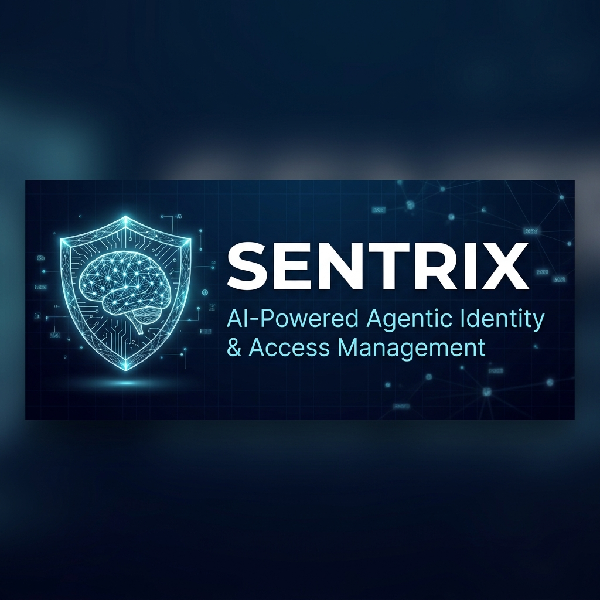
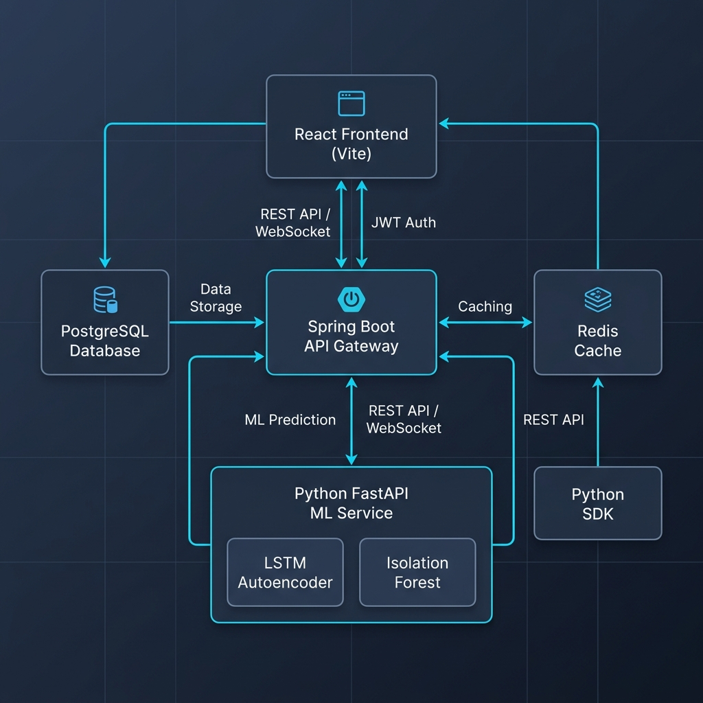
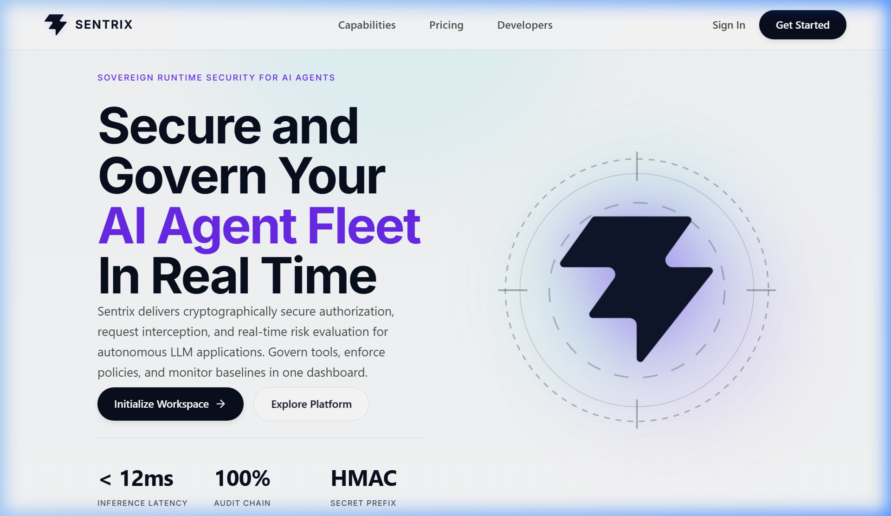
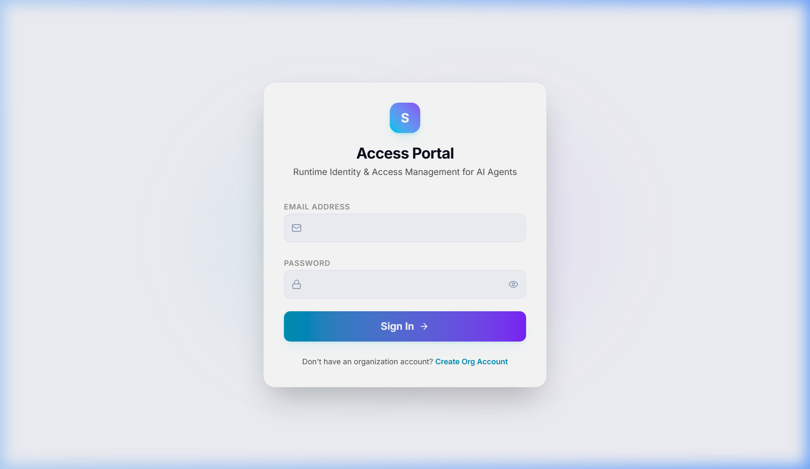
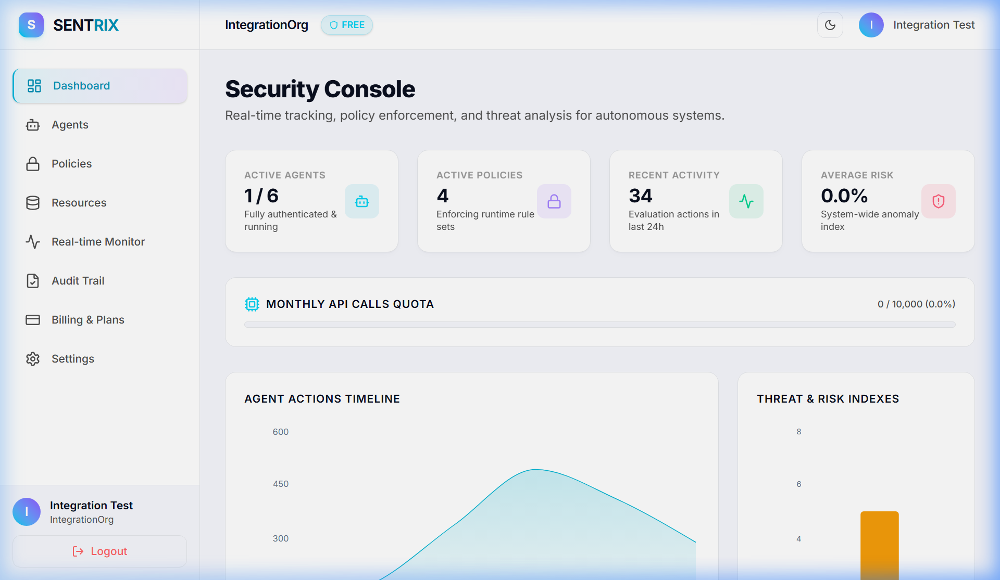

<p align="center">
  
</p>

<h1 align="center">🛡️ SENTRIX — AI-Powered Agentic Identity & Access Management</h1>

<p align="center">
  <strong>Enterprise-grade zero-trust security platform for autonomous AI agents</strong>
</p>

<p align="center">
  <a href="#-features"></a>
  <a href="#-tech-stack"></a>
  <a href="LICENSE"></a>
  <a href="#-deployment"></a>
</p>

<p align="center">
  <a href="#-quick-start">Quick Start</a> •
  <a href="#-architecture">Architecture</a> •
  <a href="#-api-reference">API Reference</a> •
  <a href="#-deployment">Deployment</a> •
  <a href="#-contributing">Contributing</a>
</p>

---

## 🚀 What is Sentrix?

**Sentrix** is an enterprise-grade **Identity and Access Management (IAM)** platform purpose-built for the era of **autonomous AI agents**. It provides real-time behavioral monitoring, machine-learning-driven anomaly detection, and zero-trust policy enforcement to ensure your AI agents operate safely and securely.

Unlike traditional IAM systems designed for human users, Sentrix understands that AI agents behave fundamentally differently — they make thousands of decisions per minute, can be compromised silently, and require continuous behavioral validation rather than one-time authentication.

### 🎯 The Problem

As organizations deploy autonomous AI agents at scale, a critical security gap emerges:
- **Traditional IAM** systems authenticate users at login and assume trust afterward
- **AI agents** can be compromised mid-session through prompt injection, model poisoning, or supply chain attacks
- **No existing solution** provides continuous behavioral monitoring with ML-driven anomaly detection for non-human identities

### 💡 The Solution

Sentrix provides a **continuous trust evaluation framework** that:
- Authenticates agents via API keys and session tokens
- Monitors every action in real-time against learned behavioral baselines
- Uses **LSTM Autoencoders** and **Isolation Forest** models to detect anomalies
- Automatically suspends compromised agents and revokes sessions
- Enforces granular, attribute-based access control policies

---

## ✨ Features

### 🔐 Identity & Access Management
- **Agent Registration & Lifecycle** — Create, manage, suspend, and revoke AI agent identities
- **API Key Authentication** — Secure SHA-256 hashed API keys with prefix-based lookup
- **Session Management** — JWT-based sessions with automatic expiration and revocation
- **Organization Multi-Tenancy** — Isolated environments per organization with role-based admin access

### 🛡️ Policy Engine
- **Granular RBAC/ABAC Policies** — Define ALLOW/DENY rules with resource patterns and action wildcards
- **Priority-Based Evaluation** — Higher-priority policies override lower ones with DENY-takes-precedence
- **Policy Versioning** — Track changes with automatic version incrementing
- **Enforcement Modes** — ENFORCING, PERMISSIVE (audit-only), and DISABLED modes

### 🧠 AI-Powered Security
- **LSTM Autoencoder** — Deep learning model that learns agent behavioral patterns and detects deviations
- **Isolation Forest** — Ensemble model for unsupervised anomaly detection across feature space
- **Dynamic Thresholds** — Per-agent calibrated detection thresholds based on behavioral variance
- **Adaptive Rate Limiting** — Request limits scale dynamically based on real-time risk scores
- **Automatic Suspension** — Agents exceeding risk threshold (≥0.80) are auto-suspended with sessions revoked

### 📊 Monitoring & Analytics
- **Real-Time Dashboard** — WebSocket-powered live security console with agent activity feeds
- **Audit Trail** — Immutable log of every authorization decision, policy change, and security event
- **Risk Visualization** — Time-series threat and risk index charts
- **Organization Analytics** — Active agents, policy coverage, API usage metrics

### 💳 Billing & Subscriptions
- **Tiered Plans** — Free, Professional ($49/mo), and Enterprise ($199/mo) with Razorpay integration
- **Usage Metering** — Track API calls against plan quotas with automatic enforcement
- **Invoice Generation** — Automated billing with downloadable invoice history

### 🐍 Developer SDK
- **Python SDK** — First-class `SentrixClient` with `authenticate()`, `authorize()`, and streaming support
- **RESTful API** — Comprehensive REST API with OpenAPI documentation
- **WebSocket Events** — Real-time security event streaming for integrations

---

## 🏗️ Architecture

<p align="center">
  
</p>

### System Components

| Component | Technology | Purpose |
|-----------|-----------|---------|
| **Frontend** | React 18 + Vite | Dashboard, policy management, real-time monitoring |
| **Backend API** | Spring Boot 3.3 (Java 21) | REST API, WebSocket, policy engine, auth |
| **ML Service** | FastAPI (Python 3.12) | Anomaly detection, risk scoring, baseline computation |
| **Database** | PostgreSQL 17 | Agent data, policies, audit logs, behavioral events |
| **Cache** | Redis 7 | Session cache, rate limiting, risk score telemetry |
| **SDK** | Python | Client library for agent integration |

### Data Flow

```
AI Agent → SDK → API Gateway → JWT Auth → Rate Limiter → Policy Engine → Decision
                                    ↓                           ↓
                              Redis Cache              PostgreSQL DB
                                    ↓                           ↓
                              Risk Score ←── ML Service ←── Behavioral Events
```

---

## 📸 Screenshots

<table>
  <tr>
    <td><br/><sub><b>Landing Page</b></sub></td>
    <td><br/><sub><b>Authentication</b></sub></td>
  </tr>
  <tr>
    <td colspan="2"><br/><sub><b>Security Console Dashboard</b></sub></td>
  </tr>
</table>

---

## 🛠️ Tech Stack

### Backend
- **Java 21** — Modern LTS with virtual threads support
- **Spring Boot 3.3** — Enterprise framework with Security, JPA, WebSocket
- **PostgreSQL 17** — Advanced relational database with JSONB support
- **Redis 7** — In-memory cache for sessions and rate limiting
- **Flyway** — Database migration management
- **Hibernate 6** — JPA ORM with optimized query generation

### Frontend
- **React 18** — Component-based UI with hooks
- **Vite 8** — Lightning-fast build tool and dev server
- **Recharts** — Composable charting library for data visualization
- **Lucide Icons** — Beautiful, consistent icon set
- **React Router 7** — Client-side routing and navigation

### ML / AI
- **Python 3.12** — ML service runtime
- **FastAPI** — High-performance async API framework
- **PyTorch 2.6** — LSTM Autoencoder for sequence-based anomaly detection
- **Scikit-Learn 1.6** — Isolation Forest and feature preprocessing
- **Pandas / NumPy** — Data processing and feature engineering

### Infrastructure
- **Google Cloud Platform** — Cloud Run, Cloud SQL, Artifact Registry
- **Docker** — Containerized deployment
- **Gradle 8.12** — Build automation for Java
- **npm** — Frontend dependency management

---

## ⚡ Quick Start

### Prerequisites

- **Java 21+** (JDK)
- **Node.js 18+** and npm
- **Python 3.12+**
- **PostgreSQL 17+**
- **Redis 7+**
- **Git**

### 1. Clone the Repository

```bash
git clone https://github.com/SakshamRajpoot10/Sentrix-Agentic-IAM.git
cd Sentrix-Agentic-IAM
```

### 2. Database Setup

```bash
# Start PostgreSQL and create the database
psql -U postgres -c "CREATE USER sentrix WITH PASSWORD 'sentrix';"
psql -U postgres -c "CREATE DATABASE sentrix OWNER sentrix;"
```

### 3. Start Redis

```bash
redis-server
```

### 4. Start the ML Service

```bash
cd ml
python -m venv .venv
.venv/Scripts/activate   # Windows
# source .venv/bin/activate  # macOS/Linux
pip install -r requirements.txt
uvicorn ml.api.main:app --port 8000
```

### 5. Start the Backend

```bash
cd backend
./gradlew bootRun --args="--spring.profiles.active=dev \
  --spring.datasource.url=jdbc:postgresql://localhost:5432/sentrix \
  --spring.datasource.username=sentrix \
  --spring.datasource.password=sentrix \
  --ml.service-url=http://localhost:8000"
```

### 6. Start the Frontend

```bash
cd frontend
npm install
npm run dev
```

### 7. Access the Application

Open [http://localhost:5173](http://localhost:5173) in your browser.

---

## 🐍 Python SDK Usage

```python
from sentrix import SentrixClient

# Initialize and authenticate
client = SentrixClient(
    base_url="http://localhost:8080",
    api_key="your-agent-api-key"
)
client.authenticate()

# Request authorization
decision = client.authorize(
    action="READ",
    resource="database:prod:users"
)

if decision.allowed:
    print(f"✅ Access granted (Risk: {decision.risk_score})")
else:
    print(f"🚫 Access denied: {decision.reason}")
```

---

## 📡 API Reference

### Authentication

| Method | Endpoint | Description |
|--------|----------|-------------|
| `POST` | `/api/v1/auth/register` | Register admin user |
| `POST` | `/api/v1/auth/login` | Admin login (returns JWT) |
| `POST` | `/api/v1/agent/authenticate` | Agent API key authentication |
| `POST` | `/api/v1/agent/authorize` | Agent authorization decision |

### Agent Management

| Method | Endpoint | Description |
|--------|----------|-------------|
| `GET` | `/api/v1/agents` | List all agents |
| `POST` | `/api/v1/agents` | Create new agent |
| `GET` | `/api/v1/agents/{id}` | Get agent details |
| `PUT` | `/api/v1/agents/{id}` | Update agent |
| `DELETE` | `/api/v1/agents/{id}` | Delete agent |
| `POST` | `/api/v1/agents/{id}/suspend` | Suspend agent |
| `POST` | `/api/v1/agents/{id}/reactivate` | Reactivate agent |

### Policy Management

| Method | Endpoint | Description |
|--------|----------|-------------|
| `GET` | `/api/v1/policies` | List policies |
| `POST` | `/api/v1/policies` | Create policy |
| `PUT` | `/api/v1/policies/{id}` | Update policy |
| `DELETE` | `/api/v1/policies/{id}` | Delete policy |
| `POST` | `/api/v1/policies/{id}/agents/{agentId}` | Assign policy to agent |

### ML Service

| Method | Endpoint | Description |
|--------|----------|-------------|
| `POST` | `/predict` | Get risk score for agent |
| `POST` | `/baseline/{agent_id}` | Compute behavioral baseline |
| `POST` | `/train` | Retrain ML models |
| `GET` | `/model/info` | Get model metadata |

---

## ☁️ Deployment

Sentrix is fully configured to be deployed on **Free-Tier cloud infrastructure** with zero hosting costs.

### 1. Backend, ML Service, Database & Redis (Render)

Render automatically provisions and connects your PostgreSQL, Redis cache, ML service, and Spring Boot API via the [render.yaml](render.yaml) Blueprint in this repository.

1. Create a free account on [Render](https://render.com).
2. Go to **Blueprints** -> **New Blueprint Instance**.
3. Connect your GitHub repository `Sentrix-Agentic-IAM`.
4. Render will read the `render.yaml` configuration and automatically spin up:
   - **PostgreSQL Database** (`sentrix-db`)
   - **Redis Cache** (`sentrix-redis`)
   - **FastAPI ML Service** (`sentrix-ml-service`)
   - **Spring Boot API** (`sentrix-backend-service`)
5. Click **Apply** to deploy the services.

### 2. Frontend (Vercel)

Vercel serves as the production CDN host for the React/Vite frontend.

1. Sign up/log in to [Vercel](https://vercel.com).
2. Click **Add New** -> **Project**.
3. Import your GitHub repository `Sentrix-Agentic-IAM`.
4. In the Project Settings:
   - **Framework Preset:** Select `Vite` (or let it auto-detect).
   - **Root Directory:** Select `frontend`.
   - **Build Command:** `npm run build`
   - **Output Directory:** `dist`
5. In the **Environment Variables** section, add:
   - `VITE_API_URL`: Set this to your deployed Render backend URL (e.g., `https://sentrix-backend-service.onrender.com`).
6. Click **Deploy**. Vercel will build and host your app on a free `*.vercel.app` subdomain.

---

### 🌐 Connecting a Custom Domain (Optional)

If you own a custom domain (e.g., `sentrixiam.com`), you can link it to your deployments at no additional cost:

#### For Vercel (Frontend)
1. In your Vercel Dashboard, go to **Project Settings** -> **Domains**.
2. Add your domain/subdomain (e.g., `app.sentrixiam.com`).
3. Set the CNAME record in your domain registrar's DNS configuration to point to `cname.vercel-dns.com`.

#### For Render (Backend)
1. In the Render Dashboard, go to your `sentrix-backend-service` settings.
2. Under **Custom Domains**, click **Add Custom Domain** and enter your API subdomain (e.g., `api.sentrixiam.com`).
3. Add a CNAME record in your DNS configuration pointing to your Render subdomain URL.

---

### 🐳 Local Production Deployment (Docker Compose)

To build and run the entire production-configured stack locally:

```bash
docker-compose up -d --build
```
This starts all components (PostgreSQL, Redis, Java Backend, Python ML, React Frontend, and Nginx reverse proxy) in containerized mode on port 80/443.

---

## 🗺️ Roadmap

- [x] Core IAM — Agent CRUD, API key auth, session management
- [x] Policy Engine — RBAC/ABAC with priority-based evaluation
- [x] ML Anomaly Detection — LSTM Autoencoder + Isolation Forest
- [x] Real-Time Dashboard — WebSocket-powered live monitoring
- [x] Adaptive Rate Limiting — Risk-aware dynamic throttling
- [x] Dynamic LSTM Thresholds — Per-agent calibrated detection
- [x] Python SDK — First-class client library
- [x] Billing Integration — Razorpay with tiered plans
- [ ] GraphQL API — Alternative query interface
- [ ] Terraform Modules — Infrastructure as Code
- [ ] Kubernetes Helm Charts — Container orchestration
- [ ] Multi-Region Deployment — Global edge distribution
- [ ] Agent-to-Agent Trust Chains — Delegated authorization
- [ ] Compliance Reports — SOC 2, ISO 27001 audit exports

---

## 🤝 Contributing

We welcome contributions! Please see our [Contributing Guide](CONTRIBUTING.md) for details.

1. Fork the repository
2. Create your feature branch (`git checkout -b feature/amazing-feature`)
3. Commit your changes (`git commit -m 'feat: add amazing feature'`)
4. Push to the branch (`git push origin feature/amazing-feature`)
5. Open a Pull Request

---

## 📜 License

This project is licensed under the **MIT License** — see the [LICENSE](LICENSE) file for details.

---

## 🔒 Security

For security vulnerabilities, please see our [Security Policy](SECURITY.md).

**Do not open a public issue for security vulnerabilities.** Instead, email [security@sentrix.dev](mailto:security@sentrix.dev).

---

<p align="center">
  
  <br/>
  <strong>Built with ❤️ by <a href="https://github.com/SakshamRajpoot10">Saksham Rajpoot</a></strong>
  <br/>
  <sub>Securing the future of autonomous AI agents</sub>
</p>
