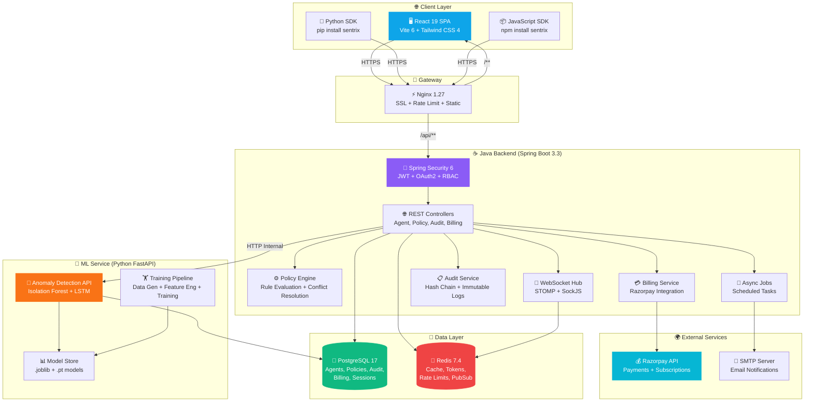
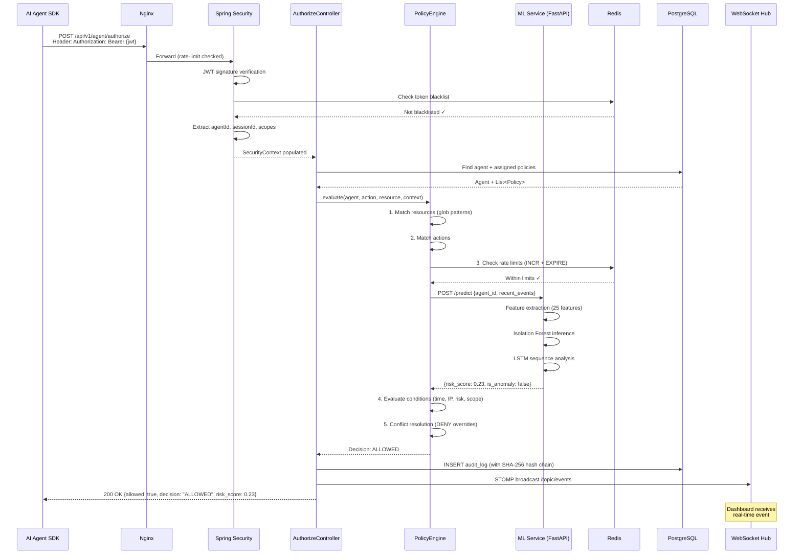
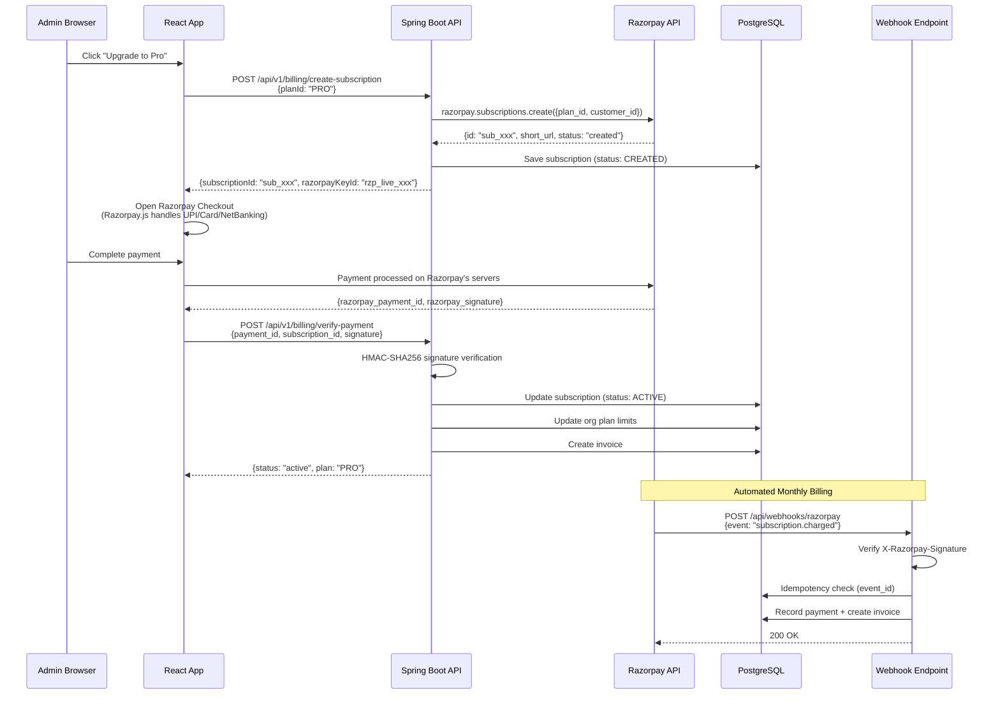
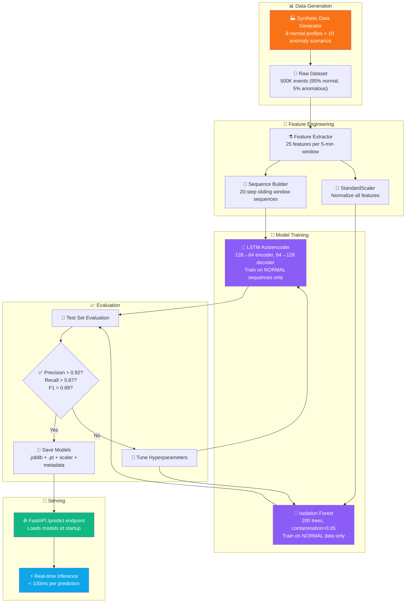
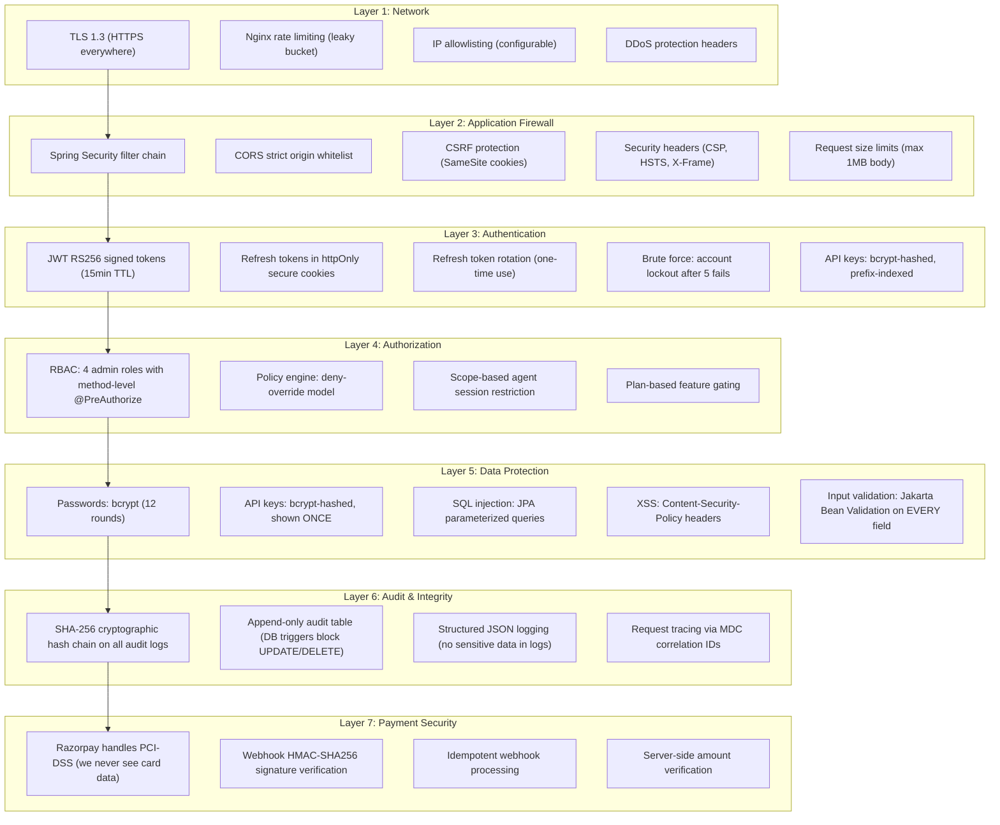

# 🛡️ SENTRIX — FINAL IMPLEMENTATION PLAN

> **Company / Startup**: **Sentrix**  
> **Product**: Sentrix — Runtime Identity & Access Management for AI Agents  
> **For**: Claude Opus 4.6 / Antigravity AI Execution  
> **Standard**: Enterprise-grade, market-launchable, zero-bug, future-proof  
> **This plan is EXECUTABLE** — follow each phase sequentially, read each prompt before starting
>
> ⚠️ **IMPORTANT**: The project name, company name, and startup name is **Sentrix**. All code, packages, SDKs, Docker images, and references use `sentrix` (lowercase) or `Sentrix` (capitalized) as the brand identity.

---

## ⚡ TECHNOLOGY STACK (ALL LATEST — 2026)

### Why Java Over Node.js For This Project

| Factor | Java 21 + Spring Boot 3.3 | Node.js + Express |
|--------|--------------------------|-------------------|
| **Security** | Spring Security 6 = gold standard. Used by banks, governments, military. | Express has no built-in security framework. |
| **Type Safety** | Compiled language. Bugs caught BEFORE runtime. | TypeScript helps but still has runtime type issues. |
| **Concurrency** | Virtual Threads (Project Loom) = millions of concurrent policy evaluations. | Single-threaded event loop, limited under CPU-intensive policy evaluation. |
| **Enterprise Trust** | Fortune 500 companies expect Java backends for security products. | Perceived as less enterprise-grade. |
| **Your Expertise** | You know Java full-stack. You can maintain, debug, and extend this. | You'd need to learn Node.js patterns. |
| **Longevity** | Java 21 LTS supported until 2031. Spring Boot backward-compatible. | Node.js LTS = 30 months. Express has breaking changes. |
| **Performance** | JIT-compiled, optimized over runtime, GraalVM native option. | V8 is fast but can't match JVM for long-running servers. |

**VERDICT: Java wins for an IAM security startup. Not even close.**

---

### Complete Technology Matrix

#### Backend (Java)

| Component | Technology | Version | Why |
|-----------|-----------|---------|-----|
| **Language** | Java | 21 LTS | Records, sealed classes, pattern matching, virtual threads. LTS until 2031. |
| **Framework** | Spring Boot | 3.3.x | Latest stable. Jakarta EE 10, auto-config, embedded Tomcat. |
| **Security** | Spring Security | 6.3.x | JWT + OAuth2 Resource Server. Method-level security. CSRF, CORS, headers. |
| **Data Access** | Spring Data JPA + Hibernate | 6.5.x | Type-safe repositories, automatic query generation, audit fields. |
| **Migrations** | Flyway | 10.x | Version-controlled DB migrations. Industry standard in Java. |
| **Validation** | Jakarta Bean Validation | 3.1 | Annotation-based (`@NotNull`, `@Email`, `@Size`). Fails fast. |
| **WebSocket** | Spring WebSocket + STOMP | 6.x | Native Spring support, STOMP protocol, SockJS fallback. |
| **Caching** | Spring Cache + Caffeine + Redis | Latest | Caffeine for L1 (in-memory), Redis for L2 (distributed). |
| **Redis Client** | Lettuce | 6.x | Non-blocking, reactive, connection pooling. Default in Spring. |
| **Build Tool** | Gradle | 8.8+ | 2x faster than Maven. Kotlin DSL, dependency locking. |
| **API Docs** | SpringDoc OpenAPI | 2.5+ | Auto-generates Swagger UI from code annotations. |
| **DTO Mapping** | MapStruct | 1.6+ | Compile-time DTO↔Entity mapping. Zero runtime overhead. |
| **Lombok** | Lombok | 1.18.x | Reduces boilerplate (`@Data`, `@Builder`, `@Slf4j`). |
| **JWT** | jjwt (io.jsonwebtoken) | 0.12.x | Latest, secure JWT creation/parsing. |
| **Payment** | Razorpay Java SDK | 1.4.x | Official SDK. Subscriptions, payments, webhooks. |
| **Email** | Spring Mail + Thymeleaf | Latest | HTML email templates for invoices, alerts. |
| **Logging** | Logback + SLF4J | Latest | Structured JSON logging. MDC for request tracing. |
| **Monitoring** | Spring Actuator + Micrometer | Latest | Health checks, metrics, Prometheus-compatible. |
| **Testing** | JUnit 5 + Mockito + TestContainers | Latest | Real PostgreSQL/Redis in tests via Docker containers. |
| **HTTP Client** | Spring WebClient | 6.x | Non-blocking HTTP for calling ML service. |

#### Frontend

| Component | Technology | Version | Why |
|-----------|-----------|---------|-----|
| **UI Library** | React | 19 | Latest. `use()` hook, Server Components ready, improved Suspense. |
| **Build Tool** | Vite | 6.x | Fastest build tool. Rolldown bundler (Rust-based), instant HMR. |
| **Language** | TypeScript | 5.5+ | Latest. Inferred type predicates, `@import` types. |
| **Styling** | Tailwind CSS | 4.x | New Oxide engine (Rust-based), 2x faster, zero-config CSS. |
| **Animations** | Framer Motion | 11.x | GPU-accelerated, spring physics, layout animations. |
| **Charts** | Recharts | 2.x | React-native D3 charts, responsive, animated. |
| **Routing** | React Router | 7.x | Latest. Framework-agnostic, type-safe routes. |
| **State** | React Context + useReducer | Built-in | No external state library needed. |
| **Forms** | React Hook Form + Zod | 7.x + 3.x | Minimal re-renders + type-safe validation. |
| **HTTP** | Axios | 1.x | Interceptors, retry, token injection. |
| **WebSocket** | SockJS + @stomp/stompjs | Latest | Matches Spring WebSocket STOMP backend. |
| **Icons** | Lucide React | Latest | Tree-shakeable, 1500+ icons. |
| **Fonts** | Inter + JetBrains Mono | Latest | Via Google Fonts CDN. |
| **Toasts** | Sonner | 1.x | Latest toast library. Stackable, promise-based, beautiful defaults. |
| **Date** | date-fns | 3.x | Tree-shakeable, immutable, latest. |

#### ML/AI Service

| Component | Technology | Version | Why |
|-----------|-----------|---------|-----|
| **Language** | Python | 3.12 | Latest stable. Faster interpreter, better error messages. |
| **Framework** | FastAPI | 0.115+ | Async, auto OpenAPI, Pydantic v2 (Rust-based). |
| **ML** | scikit-learn | 1.5+ | Isolation Forest, StandardScaler, Pipeline. |
| **Deep Learning** | PyTorch | 2.4+ | LSTM Autoencoder. PyTorch > TensorFlow in 2026 (more active dev). |
| **Data** | NumPy 2.0 + Pandas 2.2 | Latest | NumPy 2.0 = major performance improvements. |
| **Validation** | Pydantic | 2.8+ | Rust-based core, 5x faster than v1. |
| **Model Serving** | FastAPI + joblib | Latest | Direct model loading, zero overhead. |

#### Database

| Component | Technology | Version | Why |
|-----------|-----------|---------|-----|
| **Primary** | PostgreSQL | 17 | Latest. Incremental sort, JSON improvements, better vacuum. |
| **Cache** | Redis | 7.4 | Latest. Redis Functions, better ACLs. |

#### DevOps

| Component | Technology | Version | Why |
|-----------|-----------|---------|-----|
| **Containers** | Docker + Compose v2 | Latest | Standard containerization. |
| **Reverse Proxy** | Nginx | 1.27 | SSL termination, static serving, proxy. |
| **JDK** | Eclipse Temurin | 21 LTS | Open-source, free, production-grade JDK. |

---

## 📐 SYSTEM ARCHITECTURE

### High-Level Architecture Diagram



### Request Flow: Agent Authorization (Critical Path)



### Payment Flow (Razorpay)



### ML Training Pipeline



---

## 📁 PROJECT STRUCTURE (EXACT)

```
sentrix/
│
├── backend/                                    # ☕ JAVA SPRING BOOT
│   ├── build.gradle.kts                        # Gradle build (Kotlin DSL)
│   ├── settings.gradle.kts                     # Project settings
│   ├── gradle.properties                       # Gradle properties
│   ├── Dockerfile                              # Multi-stage Docker build
│   ├── src/
│   │   ├── main/
│   │   │   ├── java/com/sentrix/
│   │   │   │   ├── SentrixApplication.java            # @SpringBootApplication entry
│   │   │   │   │
│   │   │   │   ├── config/
│   │   │   │   │   ├── SecurityConfig.java            # Spring Security filter chain
│   │   │   │   │   ├── JwtConfig.java                 # JWT properties + beans
│   │   │   │   │   ├── WebSocketConfig.java           # STOMP WebSocket config
│   │   │   │   │   ├── RedisConfig.java               # Redis connection + cache
│   │   │   │   │   ├── CorsConfig.java                # CORS configuration
│   │   │   │   │   ├── RazorpayConfig.java            # Razorpay client bean
│   │   │   │   │   ├── WebClientConfig.java           # HTTP client for ML service
│   │   │   │   │   ├── AsyncConfig.java               # Virtual threads executor
│   │   │   │   │   └── OpenApiConfig.java             # Swagger/OpenAPI config
│   │   │   │   │
│   │   │   │   ├── security/
│   │   │   │   │   ├── JwtTokenProvider.java          # JWT create/validate/refresh
│   │   │   │   │   ├── JwtAuthenticationFilter.java   # OncePerRequestFilter for JWT
│   │   │   │   │   ├── AgentApiKeyFilter.java         # API key authentication filter
│   │   │   │   │   ├── CustomUserDetailsService.java  # Load admin users
│   │   │   │   │   ├── CustomAgentDetailsService.java # Load agent identities
│   │   │   │   │   ├── SecurityUtils.java             # Get current user helper
│   │   │   │   │   └── RateLimitFilter.java           # Redis-backed rate limiting
│   │   │   │   │
│   │   │   │   ├── entity/
│   │   │   │   │   ├── AdminUser.java                 # @Entity
│   │   │   │   │   ├── RefreshToken.java
│   │   │   │   │   ├── Organization.java
│   │   │   │   │   ├── Agent.java
│   │   │   │   │   ├── Policy.java
│   │   │   │   │   ├── AgentPolicy.java
│   │   │   │   │   ├── Resource.java
│   │   │   │   │   ├── AgentSession.java
│   │   │   │   │   ├── AuditLog.java
│   │   │   │   │   ├── BehavioralEvent.java
│   │   │   │   │   ├── Subscription.java
│   │   │   │   │   ├── Payment.java
│   │   │   │   │   ├── Invoice.java
│   │   │   │   │   ├── UsageRecord.java
│   │   │   │   │   ├── WebhookEvent.java
│   │   │   │   │   └── SystemSetting.java
│   │   │   │   │
│   │   │   │   ├── enums/
│   │   │   │   │   ├── AdminRole.java                 # SUPER_ADMIN, ADMIN, AGENT_MANAGER, VIEWER
│   │   │   │   │   ├── AgentStatus.java               # ACTIVE, SUSPENDED, REVOKED, DECOMMISSIONED
│   │   │   │   │   ├── AgentType.java                 # AUTONOMOUS, SEMI_AUTONOMOUS, SUPERVISED, TOOL
│   │   │   │   │   ├── PolicyEffect.java              # ALLOW, DENY, CHALLENGE
│   │   │   │   │   ├── PolicyEnforcement.java         # ENFORCING, PERMISSIVE, DISABLED
│   │   │   │   │   ├── SensitivityLevel.java          # PUBLIC → CRITICAL (5 levels)
│   │   │   │   │   ├── AuditDecision.java             # ALLOWED, DENIED, CHALLENGED, ERROR
│   │   │   │   │   ├── SessionStatus.java             # ACTIVE, EXPIRED, REVOKED
│   │   │   │   │   ├── SubscriptionPlan.java          # FREE, PRO, ENTERPRISE
│   │   │   │   │   ├── SubscriptionStatus.java        # ACTIVE, PAST_DUE, CANCELLED, TRIALING
│   │   │   │   │   ├── PaymentStatus.java             # PENDING, CAPTURED, FAILED, REFUNDED
│   │   │   │   │   └── InvoiceStatus.java             # DRAFT, ISSUED, PAID, OVERDUE
│   │   │   │   │
│   │   │   │   ├── repository/
│   │   │   │   │   ├── AdminUserRepository.java       # JpaRepository + custom queries
│   │   │   │   │   ├── RefreshTokenRepository.java
│   │   │   │   │   ├── OrganizationRepository.java
│   │   │   │   │   ├── AgentRepository.java
│   │   │   │   │   ├── PolicyRepository.java
│   │   │   │   │   ├── AgentPolicyRepository.java
│   │   │   │   │   ├── ResourceRepository.java
│   │   │   │   │   ├── AgentSessionRepository.java
│   │   │   │   │   ├── AuditLogRepository.java
│   │   │   │   │   ├── BehavioralEventRepository.java
│   │   │   │   │   ├── SubscriptionRepository.java
│   │   │   │   │   ├── PaymentRepository.java
│   │   │   │   │   ├── InvoiceRepository.java
│   │   │   │   │   └── WebhookEventRepository.java
│   │   │   │   │
│   │   │   │   ├── dto/
│   │   │   │   │   ├── request/
│   │   │   │   │   │   ├── LoginRequest.java
│   │   │   │   │   │   ├── RegisterRequest.java
│   │   │   │   │   │   ├── CreateAgentRequest.java
│   │   │   │   │   │   ├── UpdateAgentRequest.java
│   │   │   │   │   │   ├── CreatePolicyRequest.java
│   │   │   │   │   │   ├── UpdatePolicyRequest.java
│   │   │   │   │   │   ├── CreateResourceRequest.java
│   │   │   │   │   │   ├── AuthorizeRequest.java      # Agent SDK authorization
│   │   │   │   │   │   ├── SubscribeRequest.java
│   │   │   │   │   │   └── VerifyPaymentRequest.java
│   │   │   │   │   │
│   │   │   │   │   └── response/
│   │   │   │   │       ├── AuthResponse.java          # accessToken, refreshToken
│   │   │   │   │       ├── AgentResponse.java         # Agent details (no key hash)
│   │   │   │   │       ├── AgentCreatedResponse.java  # Includes plaintext API key (ONCE)
│   │   │   │   │       ├── PolicyResponse.java
│   │   │   │   │       ├── ResourceResponse.java
│   │   │   │   │       ├── AuthorizeResponse.java     # allowed, decision, risk_score
│   │   │   │   │       ├── AuditLogResponse.java
│   │   │   │   │       ├── AnalyticsResponse.java
│   │   │   │   │       ├── SubscriptionResponse.java
│   │   │   │   │       ├── InvoiceResponse.java
│   │   │   │   │       ├── PlanResponse.java
│   │   │   │   │       ├── DashboardResponse.java
│   │   │   │   │       ├── PageResponse.java          # Generic paginated response
│   │   │   │   │       └── ErrorResponse.java         # Standardized error format
│   │   │   │   │
│   │   │   │   ├── mapper/
│   │   │   │   │   ├── AgentMapper.java               # MapStruct: Entity ↔ DTO
│   │   │   │   │   ├── PolicyMapper.java
│   │   │   │   │   ├── ResourceMapper.java
│   │   │   │   │   ├── AuditLogMapper.java
│   │   │   │   │   └── InvoiceMapper.java
│   │   │   │   │
│   │   │   │   ├── controller/
│   │   │   │   │   ├── AuthController.java            # /api/v1/auth/**
│   │   │   │   │   ├── AgentController.java           # /api/v1/agents/**
│   │   │   │   │   ├── AgentSdkController.java        # /api/v1/agent/** (SDK endpoints)
│   │   │   │   │   ├── PolicyController.java          # /api/v1/policies/**
│   │   │   │   │   ├── ResourceController.java        # /api/v1/resources/**
│   │   │   │   │   ├── AuditController.java           # /api/v1/audit/**
│   │   │   │   │   ├── AnalyticsController.java       # /api/v1/analytics/**
│   │   │   │   │   ├── BillingController.java         # /api/v1/billing/**
│   │   │   │   │   ├── SettingsController.java        # /api/v1/settings/**
│   │   │   │   │   ├── WebhookController.java         # /api/webhooks/**
│   │   │   │   │   └── HealthController.java          # /api/health
│   │   │   │   │
│   │   │   │   ├── service/
│   │   │   │   │   ├── AuthService.java               # Login, register, token refresh
│   │   │   │   │   ├── AgentService.java              # Agent CRUD + lifecycle
│   │   │   │   │   ├── PolicyService.java             # Policy CRUD
│   │   │   │   │   ├── ResourceService.java           # Resource CRUD
│   │   │   │   │   ├── AuthorizeService.java          # Runtime authorization
│   │   │   │   │   ├── AuditService.java              # Audit log + hash chain
│   │   │   │   │   ├── AnalyticsService.java          # Dashboard aggregations
│   │   │   │   │   ├── BillingService.java            # Razorpay integration
│   │   │   │   │   ├── InvoiceService.java            # Invoice generation
│   │   │   │   │   ├── MlService.java                 # HTTP calls to ML service
│   │   │   │   │   ├── WebSocketService.java          # Event broadcasting
│   │   │   │   │   ├── EmailService.java              # Send emails
│   │   │   │   │   └── UsageTrackingService.java      # Track API usage
│   │   │   │   │
│   │   │   │   ├── engine/
│   │   │   │   │   ├── PolicyEngine.java              # Core evaluation orchestrator
│   │   │   │   │   ├── RuleEvaluator.java             # Single rule evaluation
│   │   │   │   │   ├── ConditionMatcher.java          # Condition evaluation
│   │   │   │   │   ├── GlobMatcher.java               # Resource glob pattern matching
│   │   │   │   │   ├── ConflictResolver.java          # DENY-override resolution
│   │   │   │   │   └── PolicyEngineResult.java        # Result record
│   │   │   │   │
│   │   │   │   ├── exception/
│   │   │   │   │   ├── GlobalExceptionHandler.java    # @ControllerAdvice
│   │   │   │   │   ├── ResourceNotFoundException.java
│   │   │   │   │   ├── DuplicateResourceException.java
│   │   │   │   │   ├── AuthenticationException.java
│   │   │   │   │   ├── AuthorizationDeniedException.java
│   │   │   │   │   ├── PlanLimitExceededException.java
│   │   │   │   │   ├── PaymentVerificationException.java
│   │   │   │   │   └── RateLimitExceededException.java
│   │   │   │   │
│   │   │   │   ├── util/
│   │   │   │   │   ├── HashChainUtil.java             # SHA-256 hash chain
│   │   │   │   │   ├── ApiKeyGenerator.java           # Secure API key generation
│   │   │   │   │   ├── CryptoUtil.java                # Encryption utilities
│   │   │   │   │   └── SlugGenerator.java             # URL-safe slug generation
│   │   │   │   │
│   │   │   │   └── scheduler/
│   │   │   │       ├── BaselineRecalculationJob.java  # @Scheduled every 15 min
│   │   │   │       ├── SessionCleanupJob.java         # Clean expired sessions
│   │   │   │       ├── UsageAggregationJob.java       # Daily usage snapshots
│   │   │   │       └── AuditRetentionJob.java         # Delete old audit logs per plan
│   │   │   │
│   │   │   └── resources/
│   │   │       ├── application.yml                    # Main config
│   │   │       ├── application-dev.yml                # Dev profile
│   │   │       ├── application-prod.yml               # Prod profile
│   │   │       ├── db/migration/
│   │   │       │   ├── V1__initial_schema.sql         # All tables
│   │   │       │   ├── V2__audit_immutability.sql     # Triggers
│   │   │       │   └── V3__seed_data.sql              # Default data
│   │   │       └── templates/
│   │   │           ├── invoice.html                   # Thymeleaf invoice template
│   │   │           └── alert-email.html               # Alert email template
│   │   │
│   │   └── test/java/com/sentrix/
│   │       ├── controller/                            # Controller integration tests
│   │       ├── service/                               # Service unit tests
│   │       ├── engine/                                # Policy engine tests
│   │       └── util/                                  # Utility tests
│
├── frontend/                                   # ⚛️ REACT 19
│   ├── package.json
│   ├── vite.config.ts
│   ├── tailwind.config.ts
│   ├── tsconfig.json
│   ├── postcss.config.js
│   ├── index.html
│   ├── Dockerfile
│   ├── src/
│   │   ├── main.tsx
│   │   ├── App.tsx
│   │   ├── styles/
│   │   │   ├── index.css                              # Tailwind + custom globals
│   │   │   ├── animations.css                         # Keyframes
│   │   │   └── themes.css                             # CSS variables (design tokens)
│   │   ├── contexts/                                  # 5 context providers
│   │   │   ├── AuthContext.tsx
│   │   │   ├── ThemeContext.tsx
│   │   │   ├── WebSocketContext.tsx
│   │   │   ├── NotificationContext.tsx
│   │   │   └── BillingContext.tsx
│   │   ├── hooks/                                     # 8 custom hooks
│   │   ├── services/                                  # 9 API service files
│   │   ├── components/                                # 30+ components
│   │   │   ├── layout/ (5)
│   │   │   ├── common/ (15)
│   │   │   ├── charts/ (5)
│   │   │   ├── agents/ (5)
│   │   │   ├── policies/ (5)
│   │   │   ├── audit/ (4)
│   │   │   ├── billing/ (4)
│   │   │   └── monitor/ (4)
│   │   ├── pages/                                     # 17 pages
│   │   └── utils/                                     # 3 utility files
│   └── public/
│       ├── favicon.svg
│       └── logo.svg
│
├── ml/                                         # 🧠 PYTHON ML SERVICE
│   ├── requirements.txt
│   ├── Dockerfile
│   ├── api/                                    # FastAPI service (4 files)
│   ├── data/                                   # Data generation (4 files)
│   ├── features/                               # Feature engineering (3 files)
│   ├── models/                                 # Model implementations (3 files)
│   ├── scoring/                                # Risk scoring (2 files)
│   ├── training/                               # Training pipeline (3 files)
│   └── tests/                                  # Tests (4 files)
│
├── sdk/                                        # 📦 SDKs
│   ├── python/                                 # Python SDK (8 files)
│   └── javascript/                             # JavaScript SDK (8 files)
│
├── docs/                                       # 📚 Documentation
│   ├── getting-started.md
│   ├── api-reference.md
│   ├── sdk-python.md
│   ├── sdk-javascript.md
│   ├── policy-language.md
│   ├── behavioral-monitoring.md
│   └── deployment-guide.md
│
├── nginx/
│   └── nginx.conf                              # Reverse proxy config
│
├── docker-compose.yml                          # Production stack
├── docker-compose.dev.yml                      # Dev overrides
├── .env.example                                # ALL environment variables
├── .gitignore
├── LICENSE
├── README.md
│
└── .ai/                                        # 🤖 AI Self-Correction
    ├── error_log.md
    ├── lessons_learned.md
    └── dev_prompts.md
```

---

## ☕ JAVA BACKEND DETAILS

### Spring Boot Configuration

```yaml
# application.yml
spring:
  application:
    name: sentrix
  
  datasource:
    url: jdbc:postgresql://${DB_HOST:localhost}:${DB_PORT:5432}/${DB_NAME:sentrix}
    username: ${DB_USER}
    password: ${DB_PASSWORD}
    hikari:
      maximum-pool-size: 20
      minimum-idle: 5
      connection-timeout: 20000
  
  jpa:
    hibernate:
      ddl-auto: validate  # Flyway handles schema
    properties:
      hibernate:
        dialect: org.hibernate.dialect.PostgreSQLDialect
        format_sql: true
        jdbc:
          batch_size: 50
  
  flyway:
    enabled: true
    locations: classpath:db/migration
  
  data:
    redis:
      host: ${REDIS_HOST:localhost}
      port: ${REDIS_PORT:6379}
      password: ${REDIS_PASSWORD}
  
  threads:
    virtual:
      enabled: true  # Enable Project Loom virtual threads

jwt:
  access-secret: ${JWT_ACCESS_SECRET}
  refresh-secret: ${JWT_REFRESH_SECRET}
  access-expiration: 900000      # 15 minutes in ms
  refresh-expiration: 604800000  # 7 days in ms

razorpay:
  key-id: ${RAZORPAY_KEY_ID}
  key-secret: ${RAZORPAY_KEY_SECRET}
  webhook-secret: ${RAZORPAY_WEBHOOK_SECRET}

ml:
  service-url: ${ML_SERVICE_URL:http://localhost:8000}
  api-key: ${ML_INTERNAL_API_KEY}
  timeout: 5000  # 5 second timeout

app:
  cors-origins: ${CORS_ORIGINS:http://localhost:5173}
  rate-limit:
    auth: 5         # 5 requests per minute for auth endpoints
    general: 100    # 100 requests per 15 minutes for general
    agent: 1000     # 1000 requests per minute for agent authorization
  auto-revoke-threshold: 0.8
  bcrypt-rounds: 12
```

### Gradle Build File

```kotlin
// build.gradle.kts
plugins {
    java
    id("org.springframework.boot") version "3.3.2"
    id("io.spring.dependency-management") version "1.1.6"
}

java {
    toolchain {
        languageVersion = JavaLanguageVersion.of(21)
    }
}

dependencies {
    // Spring Boot Starters
    implementation("org.springframework.boot:spring-boot-starter-web")
    implementation("org.springframework.boot:spring-boot-starter-security")
    implementation("org.springframework.boot:spring-boot-starter-data-jpa")
    implementation("org.springframework.boot:spring-boot-starter-data-redis")
    implementation("org.springframework.boot:spring-boot-starter-websocket")
    implementation("org.springframework.boot:spring-boot-starter-validation")
    implementation("org.springframework.boot:spring-boot-starter-actuator")
    implementation("org.springframework.boot:spring-boot-starter-mail")
    implementation("org.springframework.boot:spring-boot-starter-thymeleaf")
    implementation("org.springframework.boot:spring-boot-starter-cache")
    
    // Database
    runtimeOnly("org.postgresql:postgresql")
    implementation("org.flywaydb:flyway-core")
    implementation("org.flywaydb:flyway-database-postgresql")
    
    // JWT
    implementation("io.jsonwebtoken:jjwt-api:0.12.6")
    runtimeOnly("io.jsonwebtoken:jjwt-impl:0.12.6")
    runtimeOnly("io.jsonwebtoken:jjwt-jackson:0.12.6")
    
    // Razorpay
    implementation("com.razorpay:razorpay-java:1.4.7")
    
    // Utilities
    compileOnly("org.projectlombok:lombok")
    annotationProcessor("org.projectlombok:lombok")
    implementation("org.mapstruct:mapstruct:1.6.0")
    annotationProcessor("org.mapstruct:mapstruct-processor:1.6.0")
    implementation("com.github.ben-manes.caffeine:caffeine")
    
    // API Documentation
    implementation("org.springdoc:springdoc-openapi-starter-webmvc-ui:2.5.0")
    
    // Monitoring
    implementation("io.micrometer:micrometer-registry-prometheus")
    
    // Testing
    testImplementation("org.springframework.boot:spring-boot-starter-test")
    testImplementation("org.springframework.security:spring-security-test")
    testImplementation("org.testcontainers:postgresql")
    testImplementation("org.testcontainers:junit-jupiter")
}
```

### Key Java Code Patterns

#### Entity Example (Agent.java)

```java
@Entity
@Table(name = "agents")
@Data @Builder @NoArgsConstructor @AllArgsConstructor
public class Agent {
    @Id
    @GeneratedValue(strategy = GenerationType.UUID)
    private UUID id;

    @Column(nullable = false)
    private String name;

    @Enumerated(EnumType.STRING)
    @Column(nullable = false)
    private AgentType type;

    @Enumerated(EnumType.STRING)
    @Column(nullable = false)
    private AgentStatus status;

    @Column(name = "api_key_hash", unique = true, nullable = false)
    private String apiKeyHash;

    @Column(name = "api_key_prefix", nullable = false)
    private String apiKeyPrefix;

    @Column(name = "risk_score")
    private Double riskScore = 0.0;

    @JdbcTypeCode(SqlTypes.JSON)
    @Column(name = "behavioral_baseline", columnDefinition = "jsonb")
    private Map<String, Object> behavioralBaseline;

    @OneToMany(mappedBy = "agent", cascade = CascadeType.ALL)
    private List<AgentPolicy> policies;

    @Column(name = "created_at", updatable = false)
    @CreationTimestamp
    private Instant createdAt;

    @Column(name = "updated_at")
    @UpdateTimestamp
    private Instant updatedAt;
}
```

#### Policy Engine Example

```java
@Service
@Slf4j
public class PolicyEngine {
    
    /**
     * Evaluates whether an agent action should be allowed.
     * This is a PURE FUNCTION — no side effects during evaluation.
     */
    public PolicyEngineResult evaluate(
            Agent agent,
            String action,
            String resource,
            EvaluationContext context
    ) {
        List<Policy> policies = agent.getPolicies().stream()
            .map(AgentPolicy::getPolicy)
            .filter(p -> p.getEnforcement() != PolicyEnforcement.DISABLED)
            .sorted(Comparator.comparingInt(Policy::getPriority))
            .toList();

        if (policies.isEmpty()) {
            return PolicyEngineResult.defaultDeny("No policies assigned");
        }

        List<RuleMatch> matches = new ArrayList<>();
        
        for (Policy policy : policies) {
            List<PolicyRule> rules = parseRules(policy.getRules());
            for (PolicyRule rule : rules) {
                if (ruleEvaluator.matches(rule, action, resource, context)) {
                    matches.add(new RuleMatch(policy, rule));
                }
            }
        }

        return conflictResolver.resolve(matches, context);
    }
}
```

---

## 🔒 SECURITY ARCHITECTURE (ADVANCED)

### Defense in Depth — 7 Layers



### Security Checklist (MUST be verified)

- [ ] JWT uses RS256 or HS256 with 256-bit+ secret
- [ ] Access tokens expire in 15 minutes
- [ ] Refresh tokens are httpOnly, Secure, SameSite=Strict
- [ ] Refresh token rotation: old token invalidated on use
- [ ] Failed login attempts locked after 5 tries (30-minute cooldown)
- [ ] API keys never stored in plaintext (bcrypt hash only)
- [ ] API keys shown ONCE at creation, then only prefix visible
- [ ] Password hashing: bcrypt with 12 rounds minimum
- [ ] All user input validated with @Valid annotations
- [ ] No sensitive data in logs (filter passwords, tokens, keys)
- [ ] CORS: only allowed origins (no wildcards in production)
- [ ] CSP headers prevent inline scripts
- [ ] Audit logs are append-only (PostgreSQL triggers enforce)
- [ ] Hash chain verifiable (any tampering breaks the chain)
- [ ] Razorpay webhooks verified by HMAC signature
- [ ] Rate limiting: auth=5/min, general=100/15min, agent=1000/min
- [ ] SQL injection impossible (JPA + no raw SQL without parameters)
- [ ] All API responses use standardized error format (no stack traces)
- [ ] Health endpoint does NOT expose sensitive system info
- [ ] Actuator endpoints are secured (not publicly accessible)

---

## 💳 PRICING & BILLING

| Feature | Free | Pro ₹4,999/mo | Enterprise ₹24,999/mo |
|---------|------|---------------|----------------------|
| Active Agents | 5 | 50 | Unlimited |
| Policies | 10 | 100 | Unlimited |
| API Calls/month | 10,000 | 500,000 | Unlimited |
| Audit Retention | 7 days | 90 days | 365 days |
| Behavioral Monitoring | Statistical (z-score) | Full ML (IF + LSTM) | Full ML + Custom |
| Real-time Monitor | ❌ | ✅ | ✅ |
| WebSocket Events | ❌ | ✅ | ✅ |
| Visual Policy Builder | Basic | Full | Full + Templates |
| Audit Export | ❌ | CSV | CSV + JSON + API |
| Invoice History | ❌ | ✅ | ✅ |
| Email Alerts | ❌ | ✅ | ✅ |
| SDK Access | Read-only | Full | Full + Enterprise SDK |
| Support | Community | Email (48h SLA) | Priority (4h SLA) + Slack |

---

## 🤖 AI SELF-CORRECTION SYSTEM

### `.ai/error_log.md` — Track Every Error

```markdown
# AI Development Error Log

Format:
### ERR-XXX: [Title]
- **Phase**: Phase X
- **File**: path/to/file
- **Type**: Syntax | Logic | Type | Runtime | Design | Integration | Security
- **Error**: [Exact error message]
- **Root Cause**: [Why]
- **Fix**: [What was done]
- **Rule**: [Prevention rule added to lessons_learned.md]
```

### `.ai/lessons_learned.md` — Prevention Rules

```markdown
# Prevention Rules (READ BEFORE EVERY PHASE)

## Java / Spring Boot
1. ALWAYS annotate @Transactional on service methods that write to DB
2. NEVER return entity objects directly — use DTOs via MapStruct
3. ALWAYS use @Valid on @RequestBody parameters
4. NEVER forget @Column(name="...") when Java field name != SQL column name
5. ALWAYS handle Optional.empty() — never call .get() without .isPresent()
6. Use @JsonIgnore on password/hash fields in entities
7. @Autowired is deprecated — use constructor injection
8. NEVER catch Exception generically — catch specific exceptions
9. Virtual threads: don't use synchronized blocks (use ReentrantLock)
10. Spring Security: filter order MATTERS — JWT filter before UsernamePasswordFilter

## React / TypeScript
1. ALWAYS clean up WebSocket subscriptions in useEffect return
2. Memoize Context values with useMemo to prevent cascade re-renders
3. NEVER mutate state directly — always create new objects/arrays
4. Handle 401 responses globally in Axios interceptor (redirect to login)
5. Use ErrorBoundary around every page component
6. Tailwind CSS 4: @import "tailwindcss" (not @tailwind directives)

## PostgreSQL
1. ALWAYS add indexes for foreign keys and WHERE clause columns
2. JSONB operations: use -> for JSON, ->> for text extraction
3. UUIDs: use gen_random_uuid() (built into PG, no extension needed)
4. Timestamps: always store as TIMESTAMPTZ (with timezone)

## ML / Python
1. StandardScaler MUST be fitted on training data only, applied to test/inference
2. Save scaler WITH model (Pipeline or separate .joblib)
3. Handle NaN/null values BEFORE feature extraction
4. LSTM input shape: (batch_size, sequence_length, n_features)
5. PyTorch: always call model.eval() before inference

## Security
1. NEVER log tokens, API keys, passwords, or PII
2. ALWAYS validate Razorpay webhook signatures BEFORE processing
3. NEVER trust client-side plan/role information
4. ALWAYS use parameterized queries (JPA handles this)
5. Refresh tokens: invalidate old token when issuing new one
```

---

## 📝 PHASE-BY-PHASE EXECUTION PROMPTS

> [!IMPORTANT]
> **HOW TO USE**: Before starting each phase, the AI MUST read the corresponding prompt below. Each prompt contains exact instructions, file lists, verification steps, and known pitfalls.

### PHASE 0: Project Initialization

```
═══════════════════════════════════════════════════════════════
PHASE 0: PROJECT INITIALIZATION
═══════════════════════════════════════════════════════════════

OBJECTIVE: Create the complete project structure with all configs, 
dependencies, and build files. NO business logic yet.

WORKSPACE: D:\PROJECTS\Sentrix

STEP 1: Create directory structure
  - backend/ (Java Spring Boot)
  - frontend/ (React + Vite)
  - ml/ (Python FastAPI)
  - sdk/python/, sdk/javascript/
  - nginx/, docs/, .ai/

STEP 2: Backend setup
  a) Create build.gradle.kts with ALL dependencies listed in the plan
  b) Create settings.gradle.kts with project name "sentrix"
  c) Create src/main/java/com/sentrix/SentrixApplication.java
  d) Create src/main/resources/application.yml with all config
  e) Create Dockerfile (multi-stage: gradle build → eclipse-temurin:21-jre)

STEP 3: Frontend setup
  a) Run: npx -y create-vite@latest ./ --template react-ts
     (inside frontend/ directory)
  b) Install deps: npm install react-router-dom axios framer-motion 
     recharts lucide-react react-hook-form @hookform/resolvers zod 
     date-fns sonner @stomp/stompjs sockjs-client
  c) Install dev deps: npm install -D tailwindcss@latest postcss 
     autoprefixer @types/sockjs-client
  d) Configure tailwind.config.ts with custom design tokens
  e) Create index.css with Tailwind directives + custom properties

STEP 4: ML service setup
  a) Create requirements.txt with all Python dependencies
  b) Create Dockerfile (python:3.12-slim)
  c) Create ml/api/main.py with FastAPI skeleton

STEP 5: Infrastructure
  a) Create docker-compose.yml (postgres, redis, backend, frontend, ml, nginx)
  b) Create docker-compose.dev.yml (overrides for development)
  c) Create nginx/nginx.conf
  d) Create .env.example with EVERY variable documented
  e) Create .gitignore
  f) Create README.md

STEP 6: AI Self-Correction files
  a) Create .ai/error_log.md (empty template)
  b) Create .ai/lessons_learned.md (with prevention rules from plan)
  c) Create .ai/dev_prompts.md (copy all phase prompts)

VERIFY:
  - [ ] Gradle wrapper generates (./gradlew exists)
  - [ ] ./gradlew build succeeds (may need to skip tests initially)
  - [ ] cd frontend && npm install succeeds
  - [ ] cd frontend && npm run dev starts Vite
  - [ ] docker compose config validates
  - [ ] All directory structures match the plan

PITFALLS:
  - Gradle Kotlin DSL: use = for assignment, not :
  - Vite 6: ensure @vitejs/plugin-react is installed
  - Tailwind CSS 4: use @import "tailwindcss" not @tailwind directives
  - Java 21: ensure JAVA_HOME points to JDK 21
  - On Windows: use forward slashes in Dockerfiles
```

### PHASE 1: Database Schema + Core Backend

```
═══════════════════════════════════════════════════════════════
PHASE 1: DATABASE SCHEMA + CORE BACKEND
═══════════════════════════════════════════════════════════════

OBJECTIVE: Flyway migrations, all entities, repositories, security 
config, auth endpoints (register/login/refresh/logout).

FILES TO CREATE (in order):
  1. V1__initial_schema.sql        → All CREATE TABLE statements
  2. V2__audit_immutability.sql    → Triggers for append-only audit
  3. V3__seed_data.sql             → Default org, admin, sample data
  4. All entity classes (16 entities)
  5. All enum classes (12 enums)
  6. All repository interfaces (14 repositories)
  7. SecurityConfig.java           → Filter chain, CORS, CSRF, headers
  8. JwtTokenProvider.java         → Create/validate JWT tokens
  9. JwtAuthenticationFilter.java  → Extract JWT from Authorization header
  10. RateLimitFilter.java         → Redis-based rate limiting
  11. CustomUserDetailsService.java → Load AdminUser for Spring Security
  12. AuthController.java          → /api/v1/auth/**
  13. AuthService.java             → Business logic for auth
  14. GlobalExceptionHandler.java  → @ControllerAdvice for all errors
  15. All DTOs (request + response)

CRITICAL SECURITY RULES:
  - Spring Security filter chain ORDER:
    1. CorsFilter
    2. RateLimitFilter
    3. JwtAuthenticationFilter
    4. UsernamePasswordAuthenticationFilter (disabled)
    5. ExceptionTranslationFilter
    6. AuthorizationFilter
  
  - JWT token structure:
    Access: {sub: adminId, email, role, type: "ACCESS", iat, exp}
    Refresh: {sub: adminId, type: "REFRESH", jti: tokenId, iat, exp}
  
  - Password validation: min 8 chars, 1 uppercase, 1 lowercase, 1 digit, 1 special
  
  - First registered user automatically gets SUPER_ADMIN role
  
  - Refresh token rotation: when /auth/refresh is called, old token 
    is deleted and new one is created

VERIFY:
  - [ ] ./gradlew bootRun starts without errors
  - [ ] Flyway migrations run successfully
  - [ ] POST /api/v1/auth/register creates user → returns tokens
  - [ ] POST /api/v1/auth/login returns access + refresh tokens
  - [ ] GET /api/v1/auth/me returns user profile (with valid JWT)
  - [ ] GET /api/v1/auth/me returns 401 with invalid/expired JWT
  - [ ] Rate limiting blocks after 5 auth requests/minute
  - [ ] Swagger UI accessible at /swagger-ui.html

PITFALLS:
  - @Entity classes MUST have no-arg constructor (Lombok @NoArgsConstructor)
  - @GeneratedValue(strategy = GenerationType.UUID) for Java 21 UUID generation
  - Flyway: SQL files MUST be in src/main/resources/db/migration/
  - Flyway: naming convention is V{version}__{description}.sql (double underscore)
  - BCrypt: use BCryptPasswordEncoder bean, NOT manual hashing
  - SecurityFilterChain: .csrf(csrf -> csrf.disable()) for API-only backend
  - CORS: .allowCredentials(true) REQUIRED for cookie-based refresh tokens
  - CORS: when allowCredentials=true, cannot use allowedOrigins("*"), 
    must specify exact origins
```

### PHASE 2: Agent, Policy, Resource APIs + Policy Engine

```
═══════════════════════════════════════════════════════════════
PHASE 2: AGENT/POLICY/RESOURCE APIs + POLICY ENGINE
═══════════════════════════════════════════════════════════════

OBJECTIVE: Complete CRUD for agents, policies, resources. 
Policy engine with rule evaluation. Agent SDK authentication.

FILES TO CREATE:
  1. AgentController.java          → Admin manages agents
  2. AgentSdkController.java       → SDK: authenticate, authorize, log
  3. PolicyController.java         → Admin manages policies  
  4. ResourceController.java       → Admin manages resources
  5. AgentService.java
  6. PolicyService.java
  7. ResourceService.java
  8. AuthorizeService.java
  9. AgentApiKeyFilter.java        → Authenticate agent by API key
  10. PolicyEngine.java            → Core evaluation
  11. RuleEvaluator.java
  12. ConditionMatcher.java
  13. GlobMatcher.java
  14. ConflictResolver.java
  15. HashChainUtil.java           → SHA-256 hash chain
  16. ApiKeyGenerator.java         → Secure key generation
  17. AuditService.java            → Create audit entries
  18. AuditController.java
  19. All MapStruct mappers

AGENT API KEY FORMAT:
  - Generated: "ak_live_" + 32 random hex chars (total 40 chars)
  - Stored: bcrypt hash of full key
  - Indexed: first 8 chars stored as prefix for lookup
  - Shown: ONCE at creation in AgentCreatedResponse, then NEVER again

POLICY ENGINE ALGORITHM:
  1. Gather: Get all ENFORCING policies assigned to agent
  2. Sort: By priority (lower number = higher priority)
  3. Match: For each policy's rules:
     a. Does resource glob match? (GlobMatcher)
     b. Does action match? (exact or wildcard)
     c. Do ALL conditions pass? (ConditionMatcher)
  4. Resolve: ConflictResolver applies deny-override:
     - Any DENY match → DENIED
     - Any CHALLENGE match (no DENY) → CHALLENGED
     - Only ALLOW matches → ALLOWED
     - No matches → DEFAULT DENY
  5. Record: AuditService creates hash-chained log entry

HASH CHAIN:
  currentHash = SHA256(agentId + action + resource + decision + timestamp + prevHash)
  First entry: prevHash = "GENESIS_HASH"
  
VERIFY:
  - [ ] POST /api/v1/agents → creates agent, returns API key ONCE
  - [ ] GET /api/v1/agents → lists agents (no key hashes in response)
  - [ ] POST /api/v1/policies → creates policy with JSON rules
  - [ ] POST /api/v1/policies/{id}/agents → assigns policy to agent
  - [ ] POST /api/v1/agent/authenticate (API key header) → returns session JWT
  - [ ] POST /api/v1/agent/authorize → evaluates policy → returns decision
  - [ ] Audit logs created with valid hash chain
  - [ ] GET /api/v1/audit/chain/verify → returns integrity check result
  - [ ] DENY policy overrides ALLOW policy
  - [ ] No policies assigned → DEFAULT DENY

PITFALLS:
  - API key lookup: first find by prefix (indexed), then bcrypt.matches() 
    against stored hash. DO NOT iterate all agents.
  - GlobMatcher: "database:prod:*" must NOT match "database:staging:users"
  - Policy rules are stored as JSONB — use Jackson ObjectMapper to parse
  - Hash chain: use Instant.now().toString() for deterministic timestamp format
  - Audit logs: the Entity must NOT have @PreUpdate or @PreRemove handlers
```

### PHASE 3: ML Pipeline (Python)

```
═══════════════════════════════════════════════════════════════
PHASE 3: ML PIPELINE — TRAINING + SERVING
═══════════════════════════════════════════════════════════════

OBJECTIVE: Build complete ML pipeline — data generation, feature 
engineering, model training, evaluation, FastAPI serving.

FILES TO CREATE:
  1. ml/data/generator.py          → Synthetic data generator
  2. ml/data/profiles.py           → 8 normal agent profiles
  3. ml/data/anomaly_scenarios.py  → 10 anomaly scenarios
  4. ml/features/extractor.py      → 25-feature extraction
  5. ml/features/sequence_builder.py → Time-series sequences
  6. ml/features/preprocessor.py   → Scaling + encoding
  7. ml/models/isolation_forest.py → IF training + inference
  8. ml/models/lstm_autoencoder.py → LSTM AE training + inference
  9. ml/models/registry.py         → Model versioning + loading
  10. ml/scoring/risk_scorer.py    → Ensemble scoring
  11. ml/scoring/baseline_builder.py → Per-agent baselines
  12. ml/training/train_pipeline.py → End-to-end training
  13. ml/training/evaluate.py       → Metrics (precision, recall, F1)
  14. ml/api/main.py               → FastAPI app
  15. ml/api/routes.py             → /predict, /baseline, /train
  16. ml/api/schemas.py            → Pydantic models
  17. ml/api/dependencies.py       → Model loading

TRAINING STEPS:
  1. Generate 500K synthetic events (generator.py)
  2. Extract features → 25 features per 5-min window
  3. Build sequences → 20-step sliding windows
  4. Split: 80% train, 10% validation, 10% test (normal only for train)
  5. Fit StandardScaler on training features
  6. Train Isolation Forest (sklearn Pipeline: Scaler + IF)
  7. Train LSTM Autoencoder (PyTorch: 50 epochs, early stopping)
  8. Evaluate on test set (include anomaly samples in test)
  9. Save models: .joblib (IF + scaler), .pt (LSTM), metadata.json
  10. Start FastAPI server

TARGET METRICS:
  - Precision: > 0.92 (low false positives — don't annoy users)
  - Recall: > 0.87 (catch most real anomalies)
  - F1 Score: > 0.89
  - Inference latency: < 100ms per prediction

FASTAPI ENDPOINTS:
  POST /predict       → {events: [...]} → {risk_score, is_anomaly, severity}
  POST /baseline/{id} → Compute baseline for agent
  GET  /model/info    → Current model version + metrics
  POST /train         → Trigger retraining (background)
  GET  /health        → Service health

VERIFY:
  - [ ] python ml/training/train_pipeline.py completes without errors
  - [ ] Models saved to ml/models/saved/
  - [ ] Metrics meet targets (logged to console)
  - [ ] uvicorn ml.api.main:app --host 0.0.0.0 --port 8000 starts
  - [ ] POST /predict returns valid risk score
  - [ ] POST /predict with anomalous data returns risk_score > 0.7
  - [ ] POST /predict with normal data returns risk_score < 0.3

PITFALLS:
  - StandardScaler MUST be fitted on TRAINING data only
  - Isolation Forest: train on NORMAL data only (contamination handles noise)
  - LSTM: input shape (batch, sequence_length, features) — NOT (batch, features)
  - PyTorch: call model.eval() and torch.no_grad() during inference
  - Handle agents with < 20 events: pad sequences with zeros
  - Handle agents with no history: return default risk_score = 0.0
  - NumPy 2.0: some deprecated APIs removed — use np.bool_ not np.bool
```

### PHASE 4: Razorpay Billing + Subscription

```
═══════════════════════════════════════════════════════════════
PHASE 4: RAZORPAY BILLING + SUBSCRIPTION
═══════════════════════════════════════════════════════════════

OBJECTIVE: Real payment integration with Razorpay. Subscriptions,
checkout, webhooks, invoices, plan enforcement.

FILES TO CREATE:
  1. RazorpayConfig.java           → Razorpay client bean
  2. BillingController.java        → /api/v1/billing/**
  3. WebhookController.java        → /api/webhooks/razorpay
  4. BillingService.java           → Subscription lifecycle
  5. InvoiceService.java           → Invoice generation
  6. UsageTrackingService.java     → API call counting

RAZORPAY SETUP (user must do before testing):
  1. Create account at https://dashboard.razorpay.com
  2. Get API keys: Settings → API Keys → Generate
  3. Create Plans via API:
     POST https://api.razorpay.com/v1/plans
     {
       "period": "monthly", "interval": 1,
       "item": {"name": "Pro Plan", "amount": 499900, "currency": "INR"}
     }
  4. Set webhook URL: Settings → Webhooks → Add New
     URL: https://yourdomain.com/api/webhooks/razorpay
     Events: subscription.*, payment.*, invoice.*
  5. Copy webhook secret

WEBHOOK SECURITY:
  1. Compute: HMAC-SHA256(request_body, webhook_secret)
  2. Compare: computed_signature == X-Razorpay-Signature header
  3. Idempotency: check event_id in webhook_events table before processing
  4. Response: ALWAYS return 200 OK (even on processing errors — log them)

PLAN ENFORCEMENT:
  - On agent creation: check org.agentLimit >= current agent count
  - On API call: increment Redis counter, check vs plan limit
  - On feature access: check plan allows feature (e.g., realtime monitor)
  - PlanLimitExceededException → 403 with upgrade prompt

VERIFY:
  - [ ] GET /api/v1/billing/plans returns Free, Pro, Enterprise
  - [ ] POST /api/v1/billing/create-subscription creates Razorpay sub
  - [ ] POST /api/v1/billing/verify-payment verifies signature
  - [ ] Webhook handler processes subscription.charged event
  - [ ] Invoice auto-generated on payment
  - [ ] Plan limits enforced (can't create agent beyond limit)
  - [ ] Usage tracking increments correctly

PITFALLS:
  - Razorpay amounts are in PAISE (₹1 = 100 paise)
  - Webhook handler MUST be idempotent (same event can arrive twice)
  - NEVER trust client-sent plan/amount — verify server-side
  - Razorpay Java SDK: RazorpayClient, not Razorpay (class name)
  - Webhook endpoint must NOT require JWT auth (Razorpay can't send JWT)
  - Razorpay signature: use raw request body bytes, not parsed JSON
```

### PHASE 5: Frontend — Complete React SPA

```
═══════════════════════════════════════════════════════════════
PHASE 5: FRONTEND — ALL PAGES + COMPONENTS
═══════════════════════════════════════════════════════════════

OBJECTIVE: Build the complete React 19 SPA with all 17 pages,
30+ components, 5 contexts, real-time WebSocket, and premium UI.

ORDER OF IMPLEMENTATION:
  1. Design system: CSS variables, Tailwind config, animations
  2. Layout: AppLayout, Sidebar, Header (used by all pages)
  3. Common components: Button, Card, Modal, Table, Badge, etc.
  4. Contexts: Auth, Theme, WebSocket, Notification, Billing
  5. API services: Axios instance + all endpoint functions
  6. Pages (in order):
     a. LoginPage + RegisterPage (auth flow)
     b. DashboardPage (overview)
     c. AgentsPage + AgentDetailPage
     d. PoliciesPage + PolicyDetailPage (with visual RuleBuilder)
     e. ResourcesPage
     f. AuditPage
     g. MonitorPage (real-time WebSocket)
     h. AnalyticsPage (charts)
     i. BillingPage (Razorpay checkout)
     j. SettingsPage
     k. LandingPage + PricingPage (public, no auth)
     l. NotFoundPage

DESIGN SPECIFICATIONS:
  - Background: #0a0e1a (deep navy)
  - Cards: glassmorphism (bg-white/5, backdrop-blur-xl, border-white/10)
  - Accent gradient: from-cyan-400 to-violet-500
  - Animations: every card fades in with stagger (Framer Motion)
  - Status dots: animated pulse (green=active, red=error, yellow=warning)
  - Charts: smooth data transitions, hover tooltips
  - Tables: zebra striping, hover scale, sort indicators
  - Buttons: gradient bg, hover:scale-105, active:scale-95, shadow-lg
  - Modals: backdrop blur, slide-up entrance
  - Loading: skeleton shimmer effect (not spinners)
  - Typography: Inter for UI, JetBrains Mono for code/logs/hashes

WEBSOCKET (STOMP):
  - Connect on login with JWT token
  - Subscribe to /topic/events (all events)
  - Subscribe to /user/queue/alerts (user-specific alerts)
  - Auto-reconnect on disconnect
  - Display events in MonitorPage live feed

RAZORPAY CHECKOUT (BillingPage):
  - Add to index.html: <script src="https://checkout.razorpay.com/v1/checkout.js"></script>
  - On "Subscribe" click:
    1. Call API to create subscription → get subscription_id
    2. Open Razorpay checkout with: key, subscription_id, handler callback
    3. Handler receives: razorpay_payment_id, razorpay_signature
    4. Call API to verify payment
    5. Update BillingContext

RESPONSIVE BREAKPOINTS:
  - Desktop: 1920px, 1440px
  - Laptop: 1280px
  - Tablet: 1024px
  - Mobile: 768px (sidebar collapses to hamburger)

VERIFY:
  - [ ] Landing page renders beautifully with animations
  - [ ] Register → Login → Dashboard flow works
  - [ ] All CRUD pages work (agents, policies, resources)
  - [ ] Visual policy rule builder creates valid JSON rules
  - [ ] Audit page shows hash chain with verification
  - [ ] Real-time monitor shows WebSocket events
  - [ ] Charts render with real data
  - [ ] Billing page shows plan + opens Razorpay checkout
  - [ ] Responsive at all breakpoints
  - [ ] Dark mode is default, light mode toggle works
  - [ ] No console errors

PITFALLS:
  - React 19: use() hook syntax differs from useEffect for data fetching
  - Tailwind CSS 4: @import "tailwindcss" (not @tailwind base/components/utilities)
  - SockJS + STOMP: import { Client } from '@stomp/stompjs', not SockJS directly
  - Framer Motion: use <motion.div> not <motion div>
  - Recharts: ResponsiveContainer MUST have explicit height
  - React Router 7: use createBrowserRouter, not <BrowserRouter>
  - Context: wrap providers in correct order (Auth → Theme → WS → Notification)
  - Razorpay checkout: window.Razorpay is loaded from CDN script
```

### PHASE 6: SDKs + WebSocket + Integration

```
═══════════════════════════════════════════════════════════════
PHASE 6: SDKs + WEBSOCKET + END-TO-END INTEGRATION
═══════════════════════════════════════════════════════════════

OBJECTIVE: Python + JS SDKs, WebSocket event broadcasting from 
backend, full end-to-end integration testing.

SDK FEATURES:
  - authenticate(scopes) → session token
  - authorize(action, resource, context) → allowed/denied
  - log_action(action, resource, result, metadata) → audit entry
  - heartbeat() → keep session alive
  - logout() → revoke session
  - Auto-retry: 3 attempts with exponential backoff (1s, 2s, 4s)
  - Auto-refresh: on 401, try re-authenticate once

WEBSOCKET (Spring):
  - WebSocketConfig: enable STOMP, set /ws endpoint with SockJS
  - WebSocketService: convertAndSend to topics on events
  - Events emitted:
    - /topic/events → all agent activity
    - /topic/anomalies → behavioral anomalies
    - /topic/violations → policy violations
    - /user/queue/alerts → user-specific alerts

INTEGRATION TEST FLOW:
  1. Start: docker compose up
  2. Register admin
  3. Login → get JWT
  4. Create agent → get API key
  5. Create DENY policy for database:prod:* WRITE
  6. Assign policy to agent
  7. Python SDK: authenticate with API key
  8. Python SDK: authorize WRITE to database:prod:users → DENIED ✓
  9. Python SDK: authorize READ to database:prod:users → ALLOWED ✓
  10. Dashboard: real-time event visible ✓
  11. Audit page: entry with hash chain ✓
  12. ML: send burst of unusual requests → risk increases ✓
  13. Billing: create subscription → Razorpay checkout ✓

VERIFY:
  - [ ] Python SDK: pip install -e sdk/python/ succeeds
  - [ ] JS SDK: npm install ../sdk/javascript/ succeeds
  - [ ] Full integration test passes
  - [ ] WebSocket events reach frontend in < 100ms
  - [ ] SDK handles network errors gracefully (retry + backoff)
```

### PHASE 7: Testing + Polish + Documentation

```
═══════════════════════════════════════════════════════════════
PHASE 7: TESTING + POLISH + DOCUMENTATION
═══════════════════════════════════════════════════════════════

OBJECTIVE: Comprehensive testing, bug fixes, UI polish, documentation.

TESTING:
  - Backend: JUnit 5 tests for all services + controllers
  - Policy engine: exhaustive test cases (20+ scenarios)
  - ML: model performance validation
  - Frontend: verify all pages render without errors
  - Security: verify all auth/authz flows
  - Payment: test with Razorpay test mode keys

DOCUMENTATION:
  - README.md: setup instructions, architecture overview
  - docs/getting-started.md: quick start guide
  - docs/api-reference.md: all endpoints with examples
  - docs/sdk-python.md: Python SDK guide
  - docs/sdk-javascript.md: JS SDK guide
  - docs/policy-language.md: policy rule syntax reference
  - docs/deployment-guide.md: production deployment

FINAL POLISH:
  - Verify all animations are smooth
  - Verify loading states on all pages
  - Verify error handling shows user-friendly messages
  - Verify responsive design at all breakpoints
  - Verify dark mode consistency
  - Performance check: no unnecessary re-renders
  - Bundle size check: ensure code splitting
```

---

## 📊 COMPLETE FILE COUNT

| Section | Files |
|---------|-------|
| Backend (Java) | 65 files |
| Frontend (React) | 55 files |
| ML Service (Python) | 20 files |
| SDKs | 16 files |
| Infrastructure | 8 files |
| Documentation | 8 files |
| AI Self-Correction | 3 files |
| **TOTAL** | **~175 files** |

---

## ✅ FINAL VERIFICATION CHECKLIST

| Category | Check | Status |
|----------|-------|--------|
| **Auth** | Register + login + JWT + refresh + logout | ☐ |
| **Agents** | CRUD + API key + sessions + suspend/activate | ☐ |
| **Policies** | CRUD + visual builder + assignment + testing | ☐ |
| **Policy Engine** | DENY override + default deny + conditions + < 10ms | ☐ |
| **ML** | Training + Isolation Forest + LSTM + F1 > 0.89 | ☐ |
| **ML Inference** | Risk scoring + anomaly detection + < 100ms | ☐ |
| **Auto-Revoke** | Risk > 0.8 → sessions revoked + agent suspended | ☐ |
| **Audit** | Hash chain + immutable + verification + export | ☐ |
| **WebSocket** | Real-time events in dashboard + < 100ms | ☐ |
| **Billing** | Razorpay checkout + subscription + webhooks | ☐ |
| **Invoices** | Auto-generated + downloadable | ☐ |
| **Plan Limits** | Enforced: agent count, API calls, features | ☐ |
| **Landing Page** | Beautiful + responsive + pricing table | ☐ |
| **Dashboard** | Metrics cards + charts + live feed | ☐ |
| **Security** | All 7 layers verified | ☐ |
| **Docker** | docker compose up → everything works | ☐ |
| **SDKs** | Python + JS → authenticate + authorize | ☐ |
| **Responsive** | 1920px → 768px all pages | ☐ |
| **Dark Mode** | Default dark + light toggle | ☐ |
| **Zero Errors** | No console errors, no unhandled exceptions | ☐ |

---

> [!CAUTION]
> ## READY FOR EXECUTION
> 
> This plan contains **175 files** across **4 services** with:
> - ☕ Java 21 + Spring Boot 3.3 backend (Spring Security 6, virtual threads)
> - ⚛️ React 19 + Vite 6 + Tailwind CSS 4 frontend
> - 🧠 Python 3.12 + FastAPI ML service (Isolation Forest + LSTM)
> - 💳 Real Razorpay payment gateway
> - 🔒 7-layer security architecture
> - 📊 Cryptographic audit trail
> - 🤖 AI self-correction system
> 
> ### Before building, you need:
> 1. **JDK 21** installed (Eclipse Temurin recommended)
> 2. **Node.js 22 LTS** installed
> 3. **Python 3.12** installed
> 4. **Docker Desktop** installed and running
> 5. **Razorpay account** (create at razorpay.com, get API keys)
> 
> **Say "Go" and I begin Phase 0 immediately.**
